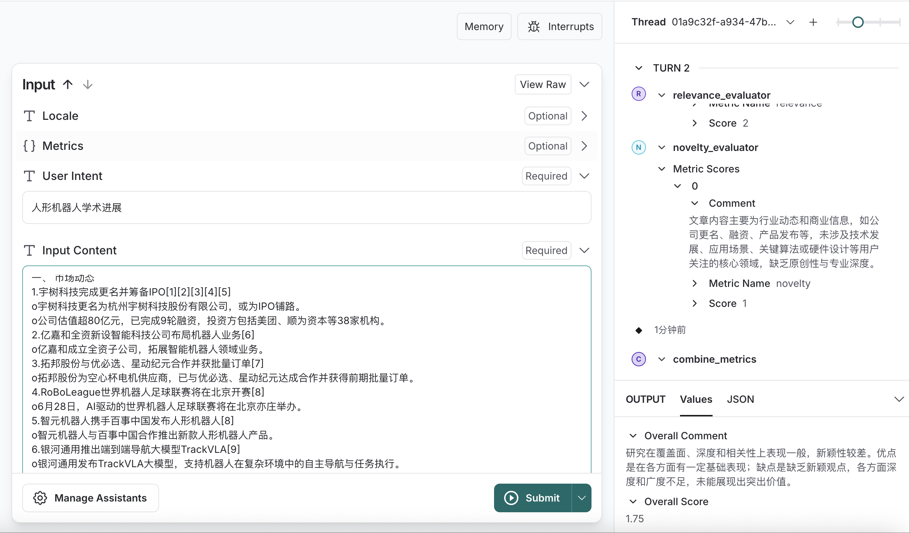
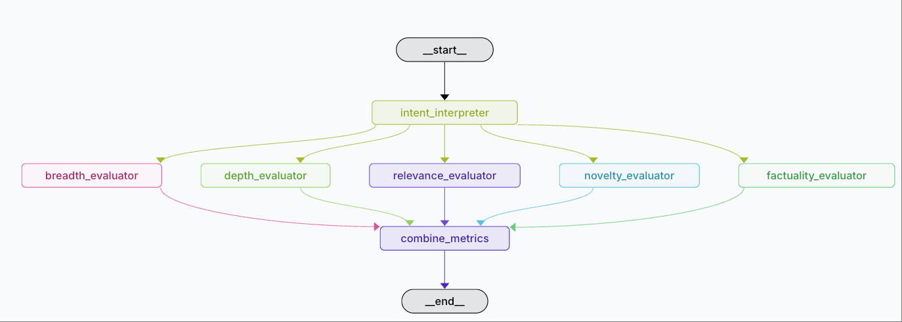

# Research-Evaluator-Agent

## 概述
Research-Evaluator-Agent 是一个开源多智能体评估框架，用于从黑盒角度对生成系统输出的文章进行多维度质量打分。它通过提示词驱动的 Agent 调用 LLM（如 GPT），无需访问模型内部信息，即可评估文章质量。
!
## 功能特性
- 提示词驱动：每个评价指标由一个 PromptEvaluator Agent 实现，通过提示词与配置的 LLM 交互获取评分。
- 多维度指标：广度（Breadth）、深度（Depth）、相关性（Relevance）、新颖性（Novelty）、事实准确性（Factuality）。
- 黑盒评估：仅依赖文章文本和外部 LLM，无需模型内部细节。


### TODO
- 完全可定制：通过提供提示词模板定义新指标，无需硬编码规则。
- 丰富接口：提供 CLI、Python SDK 和 RESTful API。
- 可配置：使用 YAML/JSON 配置提示词模板、指标权重和 LLM API Key。
- 报告输出：生成结构化的 JSON/CSV 结果，可选 HTML/Markdown 可视化报告。
- 支持批量评估和异步任务处理。

## 快速开始

### 安装
```bash
pip install research-evaluator-agent
# 或 从源码安装
git clone https://github.com/Coolgiserz/Research-Evaluator-Agent.git
cd Research-Evaluator-Agent
uv sync
```


### CLI 使用示例
```bash
revaluator evaluate \
  --input article.txt \
  --config config/default.yaml \
  --output report.json
```

### Langgraph 使用示例
```shell
langgragh dev
```


### REST API 示例
```bash
curl -X POST http://localhost:8000/evaluate \
  -H "Content-Type: application/json" \
  -d '{
    "text": "...",
    "context": "...",
    "metrics": ["breadth", "depth", "relevance", "novelty", "factuality"]
  }'
```

## 工作原理
1. **Master Agent** 接收评估请求。
2. 对于每个指标，启动一个 **Metric Evaluator Agent**，加载对应的提示词模板。
3. PromptEvaluator 向配置的 LLM 发送提示词和文章文本，并解析返回的评分和评价。
4. **Metric Combiner Agent** 汇总所有评分，应用权重后生成最终报告。


  

## 配置示例
`config/default.yaml`:
```yaml
llm:
  provider: openai
  api_key: YOUR_API_KEY
metrics:
  breadth:
    template: prompts/breadth.tpl
    weight: 0.20
  depth:
    template: prompts/depth.tpl
    weight: 0.20
  relevance:
    template: prompts/relevance.tpl
    weight: 0.25
  novelty:
    template: prompts/novelty.tpl
    weight: 0.10
  factuality:
    template: prompts/factuality.tpl
    weight: 0.25
```

## 指标建议
- **广度**: 评估文章覆盖的主题范围，提示 Agent 列出关键子主题并依据覆盖完整度打分。
- **深度**: 衡量内容的详细程度和论证深度，提示 Agent 评价解释丰富度与技术洞察力。
- **相关性**: 测量与提供的上下文或主题的一致性，通过语义匹配提示评估内容贴切度。
- **新颖性**: 判断相对于常见来源的独创性，提示 Agent 对比并评分内容的创意与新颖程度。
- **事实准确性**: 评估文章中陈述的事实是否准确，提示 Agent 验证关键断言与外部知识库的一致性并打分。

## 综合得分计算
各指标得分 s_i ∈ [0,1]，通过加权平均得到综合得分：
```math
Score = w_b·s_{breadth} + w_d·s_{depth} + w_r·s_{relevance} + w_n·s_{novelty} + w_f·s_{factuality}
```  
权重 w 之和为 1，例如：breadth=0.2, depth=0.2, relevance=0.25, novelty=0.1, factuality=0.25。
可选加权几何平均以放大低分影响：
```math
Score = ∏_{i}(s_i^{w_i})
```

## 贡献指南
请阅读 `CONTRIBUTING.md` 了解贡献流程。

## 路线图
- v0.1: 核心提示词评估指标、Web API。
- v0.2: 自定义核心提示词评估指标。
- v0.3: 指标自定义、自定义指标、Web 界面、Docker 镜像。

## 许可证
MIT 许可证，详见 `LICENSE`。
